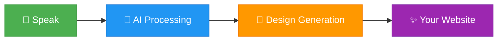

# 🎙️ VaaniWeb

> **Transform Your Voice Into Beautiful Websites in Seconds**

<div align="center">

[](https://nextjs.org/)
[](https://www.typescriptlang.org/)
[](https://www.mongodb.com/)
[](https://tailwindcss.com/)
[](https://groq.com/)
[](https://vercel.com/)

[](https://vaaniweb.com)
[](LICENSE)

</div>

VaaniWeb is an innovative AI-powered platform that revolutionizes web creation. Simply speak about your business, and watch as advanced AI instantly generates a fully functional, professionally designed website tailored to your vision.

## ✨ Why VaaniWeb?

- **🚀 Lightning Fast** - Generate complete websites in under 10 seconds
- **🎤 Voice-Powered** - No typing needed, just speak naturally
- **🤖 AI-Driven** - Powered by cutting-edge AI for intelligent design and content
- **🎨 Beautiful Templates** - 22+ professional, responsive designs
- **📱 Mobile Ready** - Works perfectly on all devices
- **🔐 Secure** - Built with enterprise-grade security

## 🏗️ Architecture Overview

<div align="center">

```
┌─────────────┐
│    User     │
│   (Voice)   │
└──────┬──────┘
       │
       ▼
┌─────────────────────┐
│   Web Speech API    │
│  (Voice → Text)     │
└──────┬──────────────┘
       │
       ▼
┌─────────────────────┐
│     Groq AI         │
│  Content Analysis   │
│  Business Type      │
│  Color Selection    │
└──────┬──────────────┘
       │
       ▼
┌─────────────────────┐
│  Template Engine    │
│  (22+ Designs)      │
└──────┬──────────────┘
       │
       ▼
┌─────────────────────┐
│  HTML Generator     │
│  (Tailwind CSS)     │
└──────┬──────────────┘
       │
       ▼
┌─────────────────────┐
│   MongoDB Atlas     │
│   (Storage)         │
└──────┬──────────────┘
       │
       ▼
┌─────────────────────┐
│   Your Website      │
│   (Live & Ready)    │
└─────────────────────┘
```

</div>

## 💡 Perfect For

- Small businesses needing instant web presence
- Entrepreneurs testing ideas quickly
- Freelancers creating client websites
- Anyone who wants a website without coding

## 🚀 Quick Start

```bash
git clone https://github.com/Saurabhji123/vaaniweb.git
cd vaaniweb
npm install
npm run dev
```

Open `http://localhost:3000` and start creating!

### Environment Variables

Copy `.env.example` to `.env.local` and update each value before running the app in production. The password-reset flow relies on `NEXT_PUBLIC_ROOT_URL` to build secure links that point back to your deployment (for example, `https://vaaniweb.com`). Without this value the reset emails will fall back to the generic domain.

- Set `NEXT_PUBLIC_GOOGLE_SITE_VERIFICATION` once you create a property in Google Search Console. Paste the verification token from the HTML tag method so the meta tag is rendered on every page.
- A canonical `<link>` tag, OpenGraph/Twitter cards, structured `Organization` data, `robots.txt`, and `sitemap.xml` are generated from `NEXT_PUBLIC_ROOT_URL` automatically.

### SEO & Search Console Checklist

1. Deploy with `NEXT_PUBLIC_ROOT_URL` pointing to your live domain (for example `https://vaaniweb.com`).
2. Visit `https://your-domain.com/sitemap.xml` and `https://your-domain.com/robots.txt` to confirm both endpoints resolve.
3. In Google Search Console choose the URL-prefix property type, enter your domain, and pick the HTML tag verification method.
4. Copy the verification token from the `content` attribute and paste it into `NEXT_PUBLIC_GOOGLE_SITE_VERIFICATION` in `.env.local`, then redeploy.
5. After redeploying, use the Search Console "Verify" button and submit `sitemap.xml` so Google can crawl your generated pages quickly.

## 🎯 How It Works

<div align="center">



</div>

### Step-by-Step Process

1. **🎤 Click & Speak** - Hold the speak button and describe your business
2. **🧠 AI Analyzes** - Groq AI processes your voice and understands context
3. **🎨 Template Selection** - Smart algorithm picks the perfect design
4. **⚡ Generation** - Creates HTML, CSS, and content in real-time
5. **✅ Done!** - Your professional website is ready to use

**Example Input**: *"A modern coffee shop in Brooklyn with cozy interiors and great ambiance"*

**What You Get**:
```
✓ Professional layout with coffee shop theme
✓ Hero section with call-to-action
✓ Gallery for showcasing products
✓ Contact form and location map
✓ Mobile-responsive design
✓ SEO-optimized content
```

## 🛠️ Tech Stack

Built with modern, cutting-edge technologies:

<div align="center">

```
┌─────────────────────────────────────────────────────────┐
│                     FRONTEND LAYER                      │
│  ┌──────────────┐  ┌──────────────┐  ┌──────────────┐ │
│  │   Next.js    │  │  TypeScript  │  │   Tailwind   │ │
│  │      14      │  │     5.0      │  │     CSS      │ │
│  └──────────────┘  └──────────────┘  └──────────────┘ │
└─────────────────────────────────────────────────────────┘
                            │
                            ▼
┌─────────────────────────────────────────────────────────┐
│                     BACKEND LAYER                       │
│  ┌──────────────┐  ┌──────────────┐  ┌──────────────┐ │
│  │  Next.js API │  │   MongoDB    │  │     JWT      │ │
│  │    Routes    │  │    Atlas     │  │     Auth     │ │
│  └──────────────┘  └──────────────┘  └──────────────┘ │
└─────────────────────────────────────────────────────────┘
                            │
                            ▼
┌─────────────────────────────────────────────────────────┐
│                       AI LAYER                          │
│  ┌──────────────┐  ┌──────────────┐  ┌──────────────┐ │
│  │   Groq AI    │  │ Web Speech  │  │    Llama     │ │
│  │   (Ultra     │  │     API      │  │  3.3 70B     │ │
│  │    Fast)     │  │              │  │              │ │
│  └──────────────┘  └──────────────┘  └──────────────┘ │
└─────────────────────────────────────────────────────────┘
```

</div>

### Technology Breakdown

- **Frontend**: Next.js 14, TypeScript, Tailwind CSS
- **Backend**: Next.js API Routes, MongoDB Atlas
- **AI**: Groq AI (Llama 3.3 70B), Web Speech API
- **Auth**: JWT, Google OAuth, Email Verification
- **Deployment**: Vercel Edge Functions

## ❓ FAQ

**Q: Is VaaniWeb free to use?**  
A: Yes! VaaniWeb offers a free tier for personal use.

**Q: Do I need coding knowledge?**  
A: Not at all! Just speak and let AI do the work.

**Q: How long does it take to generate a website?**  
A: Less than 10 seconds from speaking to having your website ready.

**Q: Can I customize the generated website?**  
A: Yes, you can edit and customize everything after generation.

**Q: What languages are supported?**  
A: Currently supports English voice input.

**Q: Is my data secure?**  
A: Absolutely! We use industry-standard encryption and security practices.

## 💼 For Investors

VaaniWeb is democratizing web creation through voice technology. We're seeking strategic partners to scale this innovative platform.

**Investment Inquiries**: vaaniweb@gmail.com

---

## 🤝 Contributing

We welcome contributions from the community! Whether you're fixing bugs, adding features, or improving documentation, your help is appreciated.

### How to Contribute

1. **Fork** the repository
2. **Create** a feature branch
3. **Make** your changes
4. **Test** thoroughly
5. **Submit** a pull request

📖 Read our detailed [Contributing Guidelines](CONTRIBUTING.md) for:
- Code style and standards
- Testing requirements
- Pull request process
- Adding new templates
- Security best practices

### Quick Links

- 🐛 [Report a Bug](https://github.com/Saurabhji123/vaaniweb/issues/new?labels=bug)
- 💡 [Suggest a Feature](https://github.com/Saurabhji123/vaaniweb/issues/new?labels=enhancement)
- 📖 [View Contributing Guide](CONTRIBUTING.md)

---

## 📜 License & Copyright

### License

This project is licensed under the **MIT License** - see the [LICENSE](LICENSE) file for details.

### Copyright Notice

**Copyright © 2025 VaaniWeb. All Rights Reserved.**

### Terms of Use

⚠️ **IMPORTANT - READ CAREFULLY**

1. **Commercial Use**: Requires explicit written permission from VaaniWeb team
2. **Attribution Required**: Must credit VaaniWeb in any derivative work
3. **No Trademark Use**: VaaniWeb name and logo cannot be used without authorization
4. **Source Code**: Viewing is allowed, but redistribution requires permission
5. **Patent Rights**: All AI algorithms and voice processing methods are proprietary

### Prohibited Actions

❌ **You MAY NOT**:
- Sell or commercialize this software without permission
- Remove copyright notices or attribution
- Use VaaniWeb branding for your own products
- Claim this work as your own
- Create competing services using this codebase

✅ **You MAY**:
- Use for personal learning and education
- Study the code and architecture
- Report bugs and suggest improvements
- Fork for personal non-commercial projects (with attribution)

### Enforcement

Violations will result in:
- Immediate DMCA takedown notices
- Legal action for commercial infringement
- Cease and desist orders
- Claims for damages and legal fees

**For licensing inquiries**: vaaniweb@gmail.com

---

## 📧 Contact

- **Email**: vaaniweb@gmail.com
- **Live Demo**: [vaaniweb.com](https://vaaniweb.com)

---

**Built with ❤️ in India 🇮🇳**

---

<div align="center">

**© 2025 VaaniWeb. All Rights Reserved.**

*Unauthorized copying, distribution, or use of this software is strictly prohibited and will be prosecuted to the fullest extent of the law.*

</div>